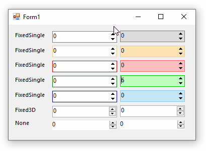

# FlatNumericUpDown

This example shows how you can customize rendering of NumericUpDown control and have a flat apperance.

The basic idea is deriving from a standard NumericUpDown and then:

- Override OnPaint to draw flat border
- Use a NativeWindow to trap WM_PAINT message of the internal [UpDownButtons](https://referencesource.microsoft.com/?WT.mc_id=DT-MVP-5003235#System.Windows.Forms/winforms/Managed/System/WinForms/UpDownBase.cs,1401) control and change its appearance:
 
